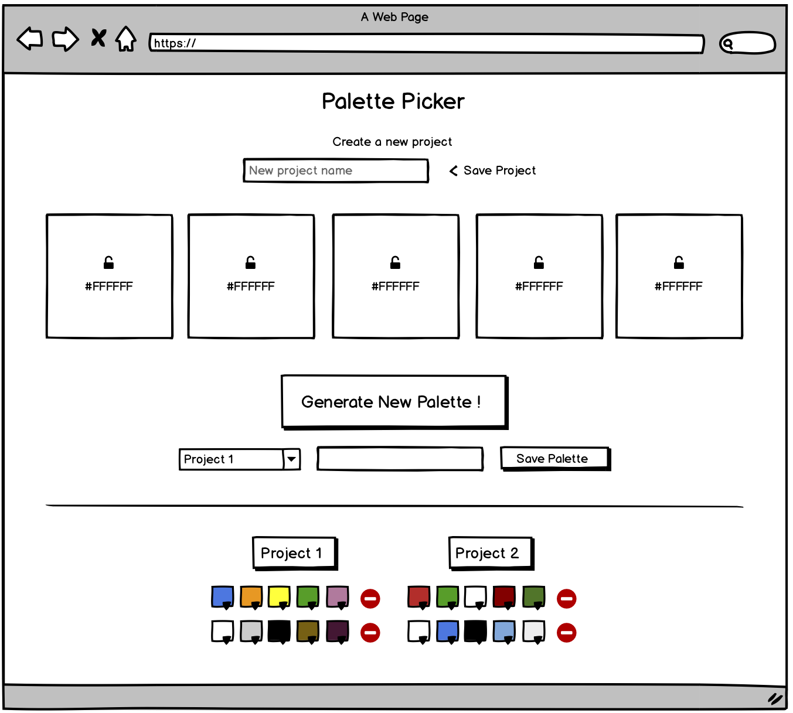
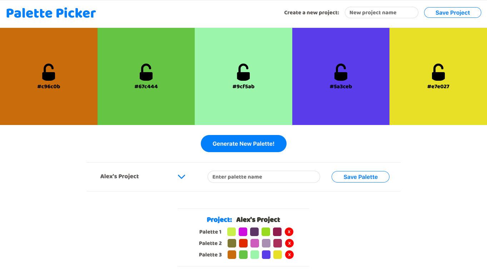
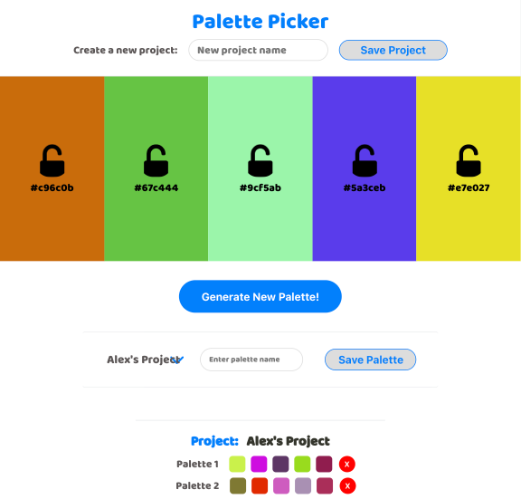
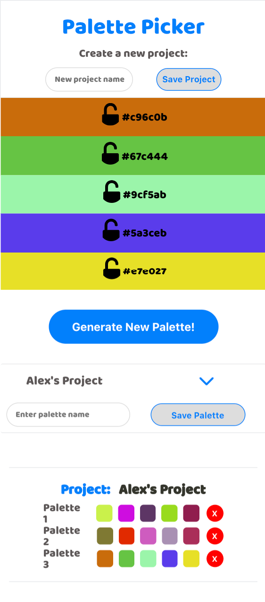

# Palette Picker
This project required us to build a palette picker, where users can generate color palettes with randomized hex codes. Users can lock colors within the palette and then save palettes under project names of their choice.

## Contributing Team Members
[alexanderela (Alexander Ela) * GitHub](https://github.com/alexanderela)

## Getting Started
`git clone` this [GitHub - alexanderela/palette-picker](https://github.com/alexanderela/palette-picker)

`npm install`

`npm start`

## Technologies Used
- SQL
- Knex
- Express
- jQuery
- Postgress

## Project Requirements
Project spec can be found [here](http://frontend.turing.io/projects/palette-picker.html)

## Wireframe

## Desktop View

## Tablet View

## Mobile View

